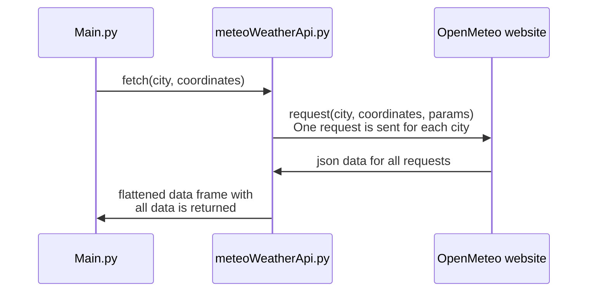
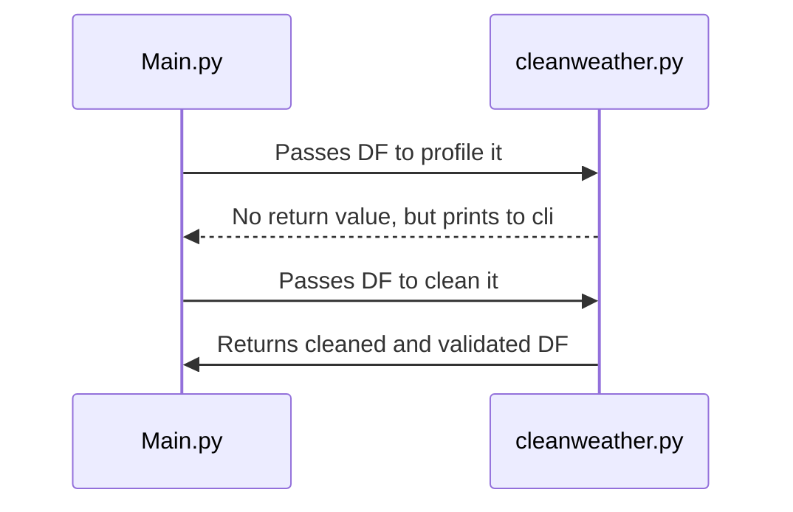
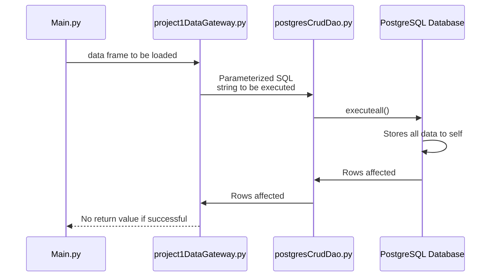
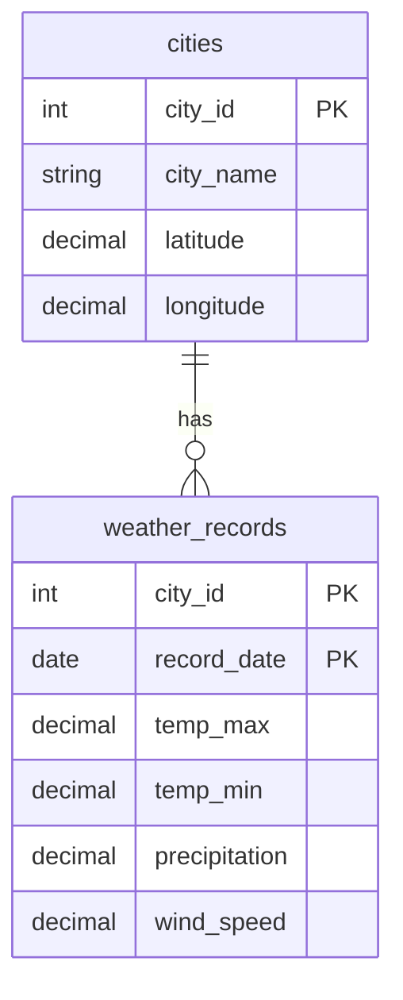
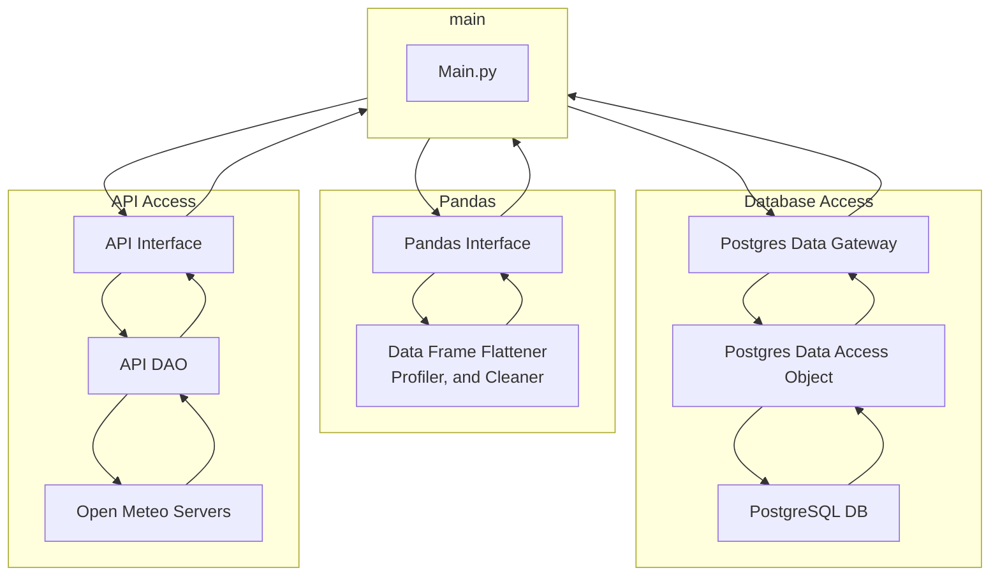

# Project 1
## Structure
### Flow of code
The python side of the code executes in Three main stages (Extract Transform Load). The first stage of the code executes by requesting the data from the API, then turning it into a dataframe. We handle for errors in case we can't connect, or I have been rate limited.

The next step is to Transform the data. This step profiles and cleans the data. Here we immediately check to see if the data is complete, and the values seem to be valid. We gain insights into the specifics, such as the size of the dataset, data types, example of df head, etc....

The final step is to Load the data. We convert from a Dataframe directly to an SQL Query, where we then load it to the database with our DAO file. I used the DAO I already made in a previous project (with the addition of a "executeall" query). To note, I clear the database every time I run this program, to ensure we have a clean slate and new data added

Finally, our Database has a structure as well. It only has two tables, which keeps things fairly simple.



## Execution
All of the different steps in this process are logged to the console as they execute, and I have additionally added various timers to measure performance. I have chosen all dates from the start of 2000 to the start of 2026. The cites I choses are Pacifica, Monterey, and Long Beach CA.

## Problems I encountered
I did not run into any data issues during the duration of this project.
This iteration of the project mostly went smoothly, however the biggest issue came up while I was trying to scale.

### Database operations are expensive (computationally)
My original DAO did not have an `executemany` statement, so each insert was its own transaction. Although this worked fine for other projects with smaller datasets, it scaled horribly when I tried to insert the 20,000 rows I collected from the API.
```
--- Summary Statistics ---
                    date     temp_max     temp_min  precipitation   wind_speed
count                 2739  2739.000000  2739.000000    2739.000000  2739.000000
mean   2025-04-01 00:00:00    65.345674    52.696422       1.488353    11.119387
min    2024-01-01 00:00:00    50.300000    37.000000       0.000000     2.600000
25%    2024-08-16 00:00:00    59.700000    49.100000       0.000000     8.000000
50%    2025-04-01 00:00:00    63.900000    52.200000       0.000000    10.300000
75%    2025-11-15 00:00:00    69.900000    56.000000       0.100000    13.200000
max    2026-07-01 00:00:00   102.500000    71.100000      75.200000    35.700000
std                    NaN     7.682745     5.438036       5.329192     4.428436
Original row count: 2739
Rows removed:       0
Rows remaining:     2739


Clearing the db took 0.0627 seconds
Loading the db took 0.4078 seconds
The slower operation took 166.0344 seconds
```
The difference is obvious with just 2700 rows, as doing each row individually takes 400 times longer. I noticed the difference gets even worse as this scales. I tried running this with the full 25 year dataset and it did not finish within the 15 minutes I allowed it to run

### Scope Creep
- This is actually my second iteration at this project. I was trying to think ahead, and ended up making a design that was so complex I scrapped all my code and started over from scratch. I believe that it was faster to do this, than it would have been to finish the original design I made

## What I would have done differently, had I been given more time
### More modular design
- I originally tried to make a super modular approach, that would allow this to scale and be reused for other projects
- The original structure looked similar to this:

I had originally planned to create a dedicated Data Transfer object class, with full separation of responsibilities between every single class and process (Only API section handles API, only Pandas section handles Dataframes, only SQL section handles sql, etc...). The original implemenation of my API DAO was originally intended to work with any url and be fully modular as well

I did not go through with this because on friday the week before it was due, I figured out that If I continue this approach, I would not finish in time. I have actually implemented a project similar to this in structure, HOWEVER, when I did that I was working with a team of 5, and we fully designed the program together before we wrote a single line of code. We went as far as to delagate each layer to different people on the team to speed up development