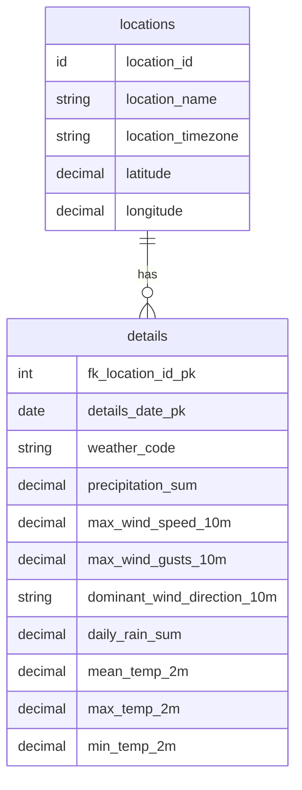

# ERD Diagram for DB
- The following is going to represent the structure of my DB. This will be shown with mermaid

```mermaid
---
Weather locations and details ERD
---
erDiagram
    locations{
        id location_id
        string location_name
        string location_timezone
        decimal latitude
        decimal longitude
    }
    details{
        int fk_location_id_pk
        date details_date_pk
        string weather_code
        decimal precipitation_sum
        decimal max_wind_speed_10m
        decimal max_wind_gusts_10m
        string dominant_wind_direction_10m
        decimal daily_rain_sum
        decimal mean_temp_2m
        decimal max_temp_2m
        decimal min_temp_2m
    } 
    locations ||--o{ details: has
```